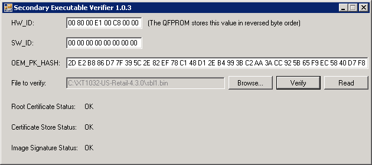

Notes about Qualcomm Secure Boot and Motorola High Assurance Boot (hab):
========================================================================
This is what I've gathered about the Moto G's MSM8226 boot process (and this actually applies to many other devices based on MSM8x60, MSM8x26 and etc.):

Part 1: Qualcomm Secure Boot:
=============================
In a normal boot process, the PBL (Primary Boot Loader, stored in the device ROM) loads and authenticates SBL1 (SBL stands for Secondary Boot Loader), stored in a partition on the device's internal storage.  
If the secondary boot loader or its authentication has failed, the PBL will go to HS-USB Emergency Download mode (a.k.a. Emergency boot, Emergency host download, EhostDL).  
The PBL authenticates the image being downloaded via EHostDL (e.g. programmer.mbn) using the same mechanism used to authenticate sbl1.  
For this reason, programmer.mbn and sbl1 share the same binary format: Header (80 bytes), followed by the executable bytecode, followed by a signature and certificates.  

The header contains the following fields (little-endian):

```
0x00 - CodeWord ("D1 DC 4B 84")
0x04 - Magic ("34 10 D7 73")
0x08 - Image type (0x0D = eHostDL image, 0x15 = SBL1, "5A 43 0B 7D" means the actual header is ahead (commonly at 0x2800), and "FF FF FF FF")
0x14 - Header size (I think, it's always 0x50)
0x18 - Loading address (Execution start address)
0x1C - Body size (Code + Signature + Certificate store size, the size qboot expects to get following the header)
0x20 - Code size
0x24 - Signature address
0x28 - Signature length (256 bytes)
0x2C - Certificate store address (after loading the image [without the header] to device memory using Loading address)
0x30 - Certificate store length
```

So if you want to load the file in IDA Pro, you should save the file without the header, and use the 'Loading address' specified in the header you removed.  
And if you want to analyze the certificate store, open the file (the one you saved without the header), and start copying from [Certificate address - Loading address].  
The certificate format is BER encoding of ASN.1 (.cer), and the certificates are written in sequence.  

While there are some execptions (e.g. Lenovo S856, Samsung SHV-E160L), most devices are configured to authenticate the secondary executable.  
The process goes like this:  

1. Certificate store validation: the lowest level X.509 certificate is verified using the standard X.509 procedure (See Note 1), each certificate is verified this way up to, but not including, the root certificate.  
2. Root certificate validation: the entire certificate is hashed using SHA256 and compared with OEM_PK_HASH (which is blown into the QFuses of the device).  
3. The image signature is RSA-decrypted (PKCS #1 v1.5) using the 2048-bit public key stored in the lowest-level certificate, this is the hash the image is expected to have.  
4. The image is hashed using an HMAC (see Note 2, Note 3) and compared against the expected image hash.  

- Note 1: X.509 certificate validation: the signature is RSA-decrypted using the public key of the parent certificate and compared with the hash of the [tbsCertificate](http://www.codeproject.com/Questions/252741/Where-is-the-signature-value-in-the-certificate).  
- Note 2: The 'Subject' field in the lowest-level certificate instructs which hash function should be used for the image HMAC, possible entries:  
        "OU = 07 0000 SHA1"  
        "OU = 07 0001 SHA256"  
        If no such entry exists, the PBL will use SHA1.  
- Note 3: This is how the image HMAC is calculated:  
        `SHA1(o_key_pad || SHA1(i_key_pad || SHA1(header || code))`  
        or, if the hash function is SHA256:  
        `SHA256(o_key_pad || SHA256(i_key_pad || SHA256(header || code))`  
        MSM8x26 / MSM8x60 / MSM8974 (e.g. Moto G / Nexus 4 / Nexus 5):  
        `o_key_pad = o_key XOR {0x5C, 0x5C, 0x5C, 0x5C, 0x5C, 0x5C, 0x5C, 0x5C}`  
        `i_key_pad = i_key XOR {0x36, 0x36, 0x36, 0x36, 0x36, 0x36, 0x36, 0x36}`  
        (o_key = HW_ID of the device and i_key = SW_ID, both are 8 bytes long)  
        (HW_ID & SW_ID are stored in the QFPROM in reversed byte order, o_key & i_key use the original byte order)  
        Other devices have different o_key_pad and i_key_pad construction and length (can be either 8 or 64 bytes).  
- Note 4: I was able to read the OEM_PK_HASH from my Moto G using the Sahara protocol using CMD=3 (qboot uses CMD=1 to read the serial number and CMD=2 to read the HW_ID).  
- Note 5: The target HW_ID & SW_ID for a given image can be found in the 'Subject' field in the lowest-level certificate.  
- Note 6: This GitHub project contains a small C# program that validates the executable against the HW_ID, SW_ID and OEM_PK_HASH:  


References:
-----------
[8960_Boot_Architecture.pdf](http://forum.xda-developers.com/showpost.php?p=31798171&postcount=21)  
[Secure boot and servicing](https://msdn.microsoft.com/en-us/library/windows/hardware/dn772079%28v=vs.85%29.aspx?f=255&MSPPError=-2147217396)
[Samsung SHV-E160L PBL Dump](http://forum.xda-developers.com/showpost.php?p=60608091&postcount=88)

Relevant information:
---------------------
[Why is a 2048-bit public RSA key represented by 540 hexadecimal characters in X.509 Certificates?](http://crypto.stackexchange.com/questions/14491/why-is-a-2048-bit-public-rsa-key-represented-by-540-hexadecimal-characters-in-x)
[mbnimg-parser](https://github.com/tegrak/Fricando/blob/master/mbnimg-parser/mbnimg-parser.py)
[SBL header information](https://groups.google.com/a/chromium.org/forum/#!topic/chromium-os-reviews/bdhIKMhxCrE)

Part 2: Motorola High Assurance Boot (hab): 
===========================================
I belive there's a Qualcomm reference implementation to secure additional steps in the booting process, and OEMs can customize it if they wishes, Motorola's secondary boot loader implements its own trusted boot mechanism (called hab) to load additional executable images.  

The header of those third-level executable images contains the following fields (little-endian):  

```
0x00 - Type (0x05 = APPSBL)
0x04 - Version (0x00000003)
0x0C - Loading address
0x10 - Body size (code + signature + certificate store size)
0x14 - Code size (the size of the executable without the header / signature / certificate store)
0x18 - Signature address
0x1C - Signature length
0x20 - Certificate store address
0x24 - Certificate store length
```

The format is not specific to Motorola, however, Motorola uses a proprietary certificate store / signature structure,  
Because the image does not contain a standard BER encoding of ASN.1, the 'Certificate store length' field will be set to 0, and both the certificate store and the signature will be stored in the signature section.  
In addition, The last 4 bytes of the code segment are the version number of the image, trying to flash an image with a lower number will result in "downgraded security version" and "preflash validation failed".  

The structure starts with 'B4 01' followed by a 2-byte integer that points to the first certificate in the chain (relative to the structure start).  
The number of the certificates in the structure is not stored in the structure, and has to be known by the reader, there are X certificates (the first is the top-level certificate) followed by X-1 file signatures (each has the same length as the modulus of the matching certificate).  
The certificate structure contains the following fields:  

```
Certificate Identifier ('01 0A')
String Identifier ('01 00 04')
Certificate Name Length (1 byte)
Certificate Name
Unknown1 (4 bytes)
Unknown2 (4 bytes)
String Identifier ('01 00 04')
Issuer Name Length (1 byte)
Issuer Name
Byte fields identifier ('02 00')
Exponent Length (2 bytes)
Exponent
Modulus Length (2 bytes)
Modulus
Certificate Signature Length (2 bytes)
Certificate Signature
```

The image authentication process goes like this:  
1. The top-level certificate is authenticated using the SRK (super root key, see Note 7):  
- The certificate signature is RSA-decrypted (PKCS #1 v1.5) using the SRK modulus and exponent.  
- The certificate (excluding the signature) is hashed using the function specified in the PKCS prefix and the hash is compared to the hash specified in the decrypted signature.  
2. Each child certificate is authenticated using the top-level certificate.  
3. The file signature is RSA-decrypted (PKCS #1 v1.5) using the matching certificate.  
4. The relevant portion of the file is hashed using the function specified in the PKCS prefix (part of the decrypted signature) and the hash is compared to the hash specified in the decrypted signature.  
- Note 7: Some phone models (e.g. the XT1032) embed the SRK in SBL1.  

References:
-----------
[Reverse Engineering Android's Aboot](http://www.newandroidbook.com/Articles/aboot.html)

Relevant information:
---------------------
[aboot header information](http://www.coreboot.org/pipermail/coreboot-gerrit/2014-September/014824.html)

Contact:
========
If you have any question, feel free to contact me.  
Tal Aloni <tal.aloni.il@gmail.com>
